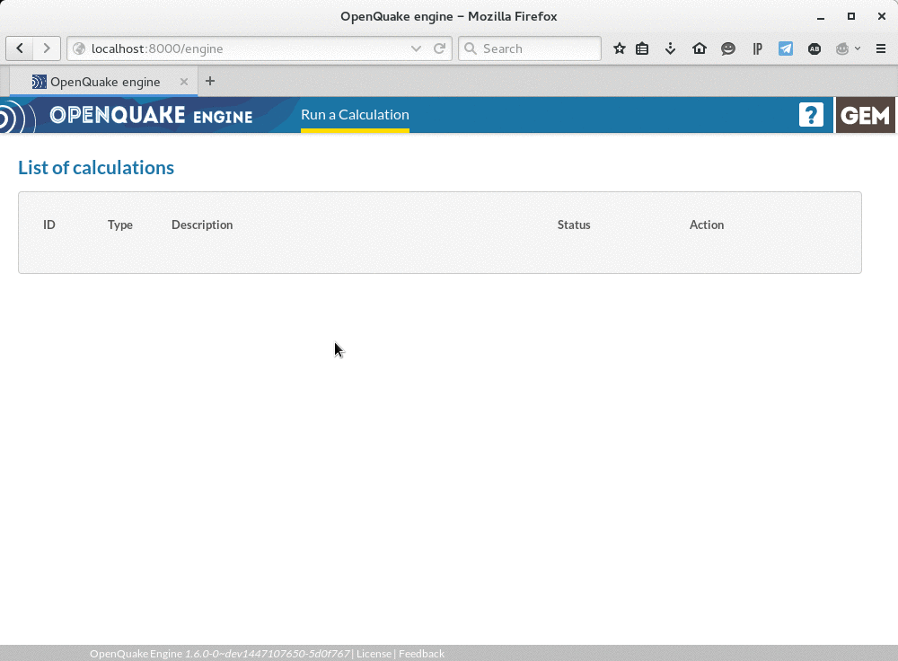
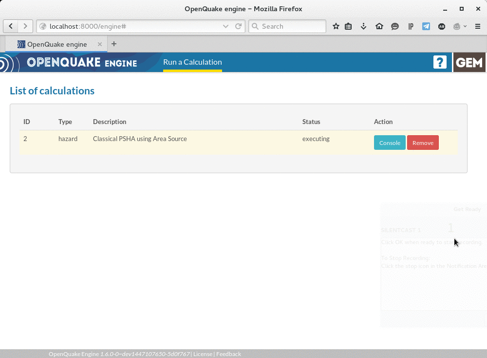
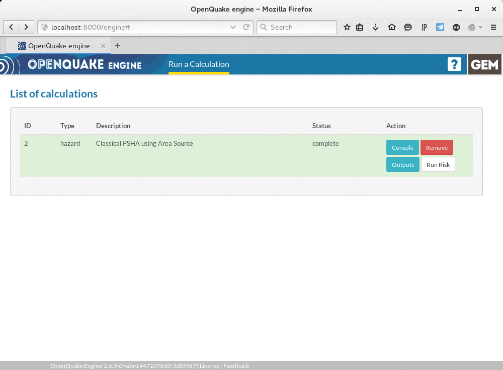

# Start the webui
## From sources
```bash
$ cd /path/to/oq-engine/openquake/server
$ python manage.py runserver
```

## From packages
```bash
$ cd /usr/lib/python2.7/dist-packages/openquake/server
$ python manage.py runserver
```

To stop the WebUI process press `CTRL-C`

# Using the webui

Open Firefox or Chrome and load the [http://localhost:8000/engine](http://localhost:8000/engine) page


## Start the calculation

Before starting a new calculation you need to prepare inputs. All the inputs file and the `job.ini` must be placed in a compressed zip file.

To start a calculation, having the input zip file, select the `Run a Calculation` button in the heade menu. A dialog window will appear: select the zip file to be uploaded and press `Open`



## Watch the console log

It can be possible to watch the log from a running calculation



The log from a previous run can be also inspected.

## Download outputs

If a calculation has run succesfully an `Outputs` button is provided. Click the `Outputs` button to see the list of outputs available for the specific calculation type. Output formats depend on the type of artifacts generated by the calculation. Click on the desired output/format to download the corresponding file



## Run a risk calculation on top of hazard

To run a risk-only calculation on top of a previous hazard run you have to click the `Run Risk` button on the corresponding hazard calculation and select the zip file containing the risk `job.ini` and the related inputs.


## Remove a calculation

To remove a calculation from the list press the `Remove` button


## Calculation status

A calculation can be in the following statuses `pre_executing`, `executing`, `complete`, `failed`


# Advanced use
## Authentication support
To `local_settings.py` add:
```python
LOCKDOWN = True
```
### Sessions and users DB bootstrap
```bash
DJANGO_SETTINGS_MODULE="openquake.server.settings" python manage.py syncdb --database=auth_db
```

### Add a new local superuser
```bash
DJANGO_SETTINGS_MODULE="openquake.server.settings" python manage.py createsuperuser --database=auth_db
```

### PAM
Process owner must be member of the `shadow` group.

To `local_settings.py` add:

```python
AUTHENTICATION_BACKENDS = (
    'django.contrib.auth.backends.ModelBackend',
    'dpam.backends.PAMBackend',
)
```

## Running with supervisord

### Supervisord
[OpenQuake Engine WebUI supervisord configuration](supervisord.md)

### Nginx
To `local_settings.py` add:

```python
STATIC_ROOT = '/var/www/webui'
```

Collect static files:

```bash
DJANGO_SETTINGS_MODULE="openquake.server.settings" python manage.py collectstatic
```

[OpenQuake Engine WebUI nginx configuration](nginx.md)
